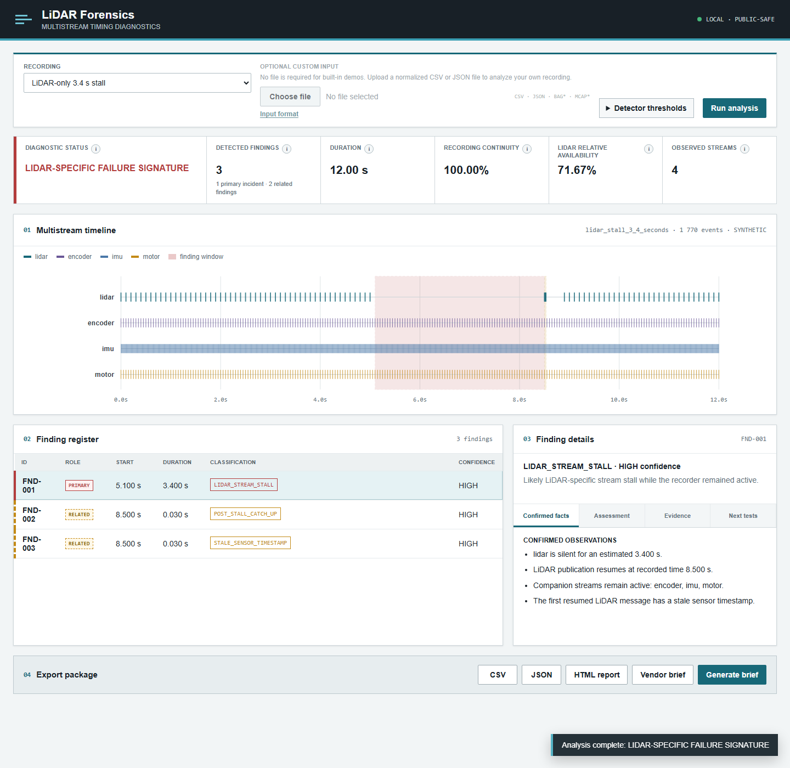
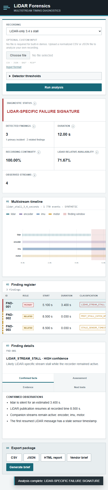

# LiDAR Forensics

**Codex-assisted detection and diagnosis of silent LiDAR stream failures.**

LiDAR Forensics is a local, public-safe diagnostic application for engineers who need to distinguish a LiDAR-specific publication stall from a recording-wide interruption. A deterministic detector analyzes normalized stream timing; an optional OpenAI layer turns only the structured detector result into a concise vendor brief.

The repository is a clean-room demonstration. It contains synthetic events, generic device names, and no customer recordings, manufacturer identifiers, confidential firmware details, or proprietary reports.

## Competition story

A field engineer encountered a sensor recording that standard processing could not explain. The engineer investigated the field failure, defined the diagnostic evidence and taxonomy, validated the engineering interpretation, and established conservative claim boundaries. Using Codex, that forensic method was converted into a reusable, public-safe diagnostic product.

During the original private forensic investigation, surviving post-failure sensor measurements were used to reconstruct usable point-cloud geometry that standard processing had treated as permanently lost. That outcome motivated the product, but it is not a feature claim for this public release. The public application focuses on detecting, characterizing, and reporting the failure signature. It does not distribute proprietary RAW data and does not claim that every damaged recording is recoverable.

Codex implemented the clean-room application, adapters, tests, deterministic synthetic datasets, interface, exports, documentation, and competition packaging. AI did not independently discover the physical failure and is not the source of measurements or engineering validation.

## Problem

A processing failure is often summarized as "data after this point is lost." That statement can hide several different physical situations. The recorder may have stopped completely, one sensor stream may have paused while companion telemetry continued, or delayed messages may have resumed with stale sensor timestamps. Those cases require different evidence and different next tests.

LiDAR Forensics makes that evidence visible before a root-cause claim is made.

## Product screenshot



The default view shows the synthetic LiDAR-only 3.4-second stall, companion streams that remain active, stale timestamp evidence, a post-stall catch-up burst, and the conservative classification selected by the detector.



## Capabilities

- Load built-in synthetic recordings or normalized CSV/JSON uploads.
- Optionally normalize ROS1 bag files with `rosbags` and MCAP files with `mcap`.
- Detect LiDAR-only silence, global recording gaps, stale sensor timestamps, catch-up bursts, unusual intervals, repeated stalls, and stream termination.
- Calculate recording continuity, LiDAR relative availability, observed stream count, stream rates, and finding confidence.
- Inspect a multistream timeline and the evidence behind every classification.
- Export `findings.csv`, `findings.json`, a standalone finding report, and a Markdown diagnostic brief.
- Generate a deterministic brief without an API key.
- Optionally use the OpenAI API with structured detector output only; raw events are never sent to the model.

## Public input policy

Proprietary vendor RAW recordings are intentionally excluded from the public repository. Real recordings should first be converted into the normalized event schema or another supported open format.

The public demo uses only:

- normalized CSV;
- normalized JSON;
- optional ROS1 BAG;
- optional MCAP;
- deterministic synthetic datasets.

## One-command demo

Windows:

```bat
run_demo.bat
```

Linux or macOS:

```sh
./run_demo.sh
```

Open [http://127.0.0.1:8765](http://127.0.0.1:8765). The launch script creates a project-local virtual environment, installs dependencies, regenerates the deterministic data, and starts FastAPI.

Manual setup:

```sh
python -m venv .venv
.venv/Scripts/python -m pip install -e ".[dev]"
.venv/Scripts/python -m lidar_forensics.synthetic
.venv/Scripts/python -m uvicorn lidar_forensics.app:app --host 127.0.0.1 --port 8765
```

Python 3.11 or newer is required.

## Input schema

Normalized CSV and JSON events contain:

| Field | Type | Meaning |
|---|---:|---|
| `timestamp_recorded` | float | Recorder or bag time in seconds |
| `timestamp_sensor` | float or null | Sensor/header time in seconds |
| `stream_name` | string | Generic stream or topic name |
| `message_index` | integer | Monotonic index within the stream |
| `point_count` | integer | Point count when applicable |
| `payload_size` | integer | Serialized payload size in bytes |
| `device_id` | string | Public-safe generic device label |

JSON may be an event array or an object with an `events` array. CSV must be UTF-8.

## Architecture

```text
CSV / JSON / ROS1 bag / MCAP
              |
              v
      normalization adapters
              |
              v
   deterministic timing detector  <--- configurable thresholds
              |
       structured AnalysisResult
         /         |          \
        v          v           v
   web UI      export layer   optional OpenAI brief
```

The detector is the source of truth. AI output cannot change measurements or classifications. See [Architecture](docs/ARCHITECTURE.md) and [Detection method](docs/DETECTION_METHOD.md).

## Detector logic

A high-confidence `LIDAR_STREAM_STALL` requires a LiDAR interval beyond the configured limit, multiple companion streams active during the silence, continued recorder time, and later LiDAR resumption. A `GLOBAL_RECORDING_GAP` requires an interval with no observed messages from any monitored stream. Timestamp and catch-up findings are reported separately so the classification remains auditable.

The summary counts all non-normal detector outputs as **detected findings**. Interruption windows such as `LIDAR_STREAM_STALL` and `GLOBAL_RECORDING_GAP` are primary incidents; timestamp and catch-up signatures are related diagnostic findings. **Recording continuity** is the share of total duration outside detected all-stream gaps. **LiDAR relative availability** is the share of recorder-active time outside LiDAR-specific unavailable windows, so a global gap reduces continuity without falsely reducing LiDAR relative availability.

All hypotheses use conservative wording. The exact root cause requires firmware logs, packet capture, driver diagnostics, or hardware telemetry.

## API-key-free and optional AI modes

No API key is required. The deterministic Markdown generator is the default and produces the same report from the same detector result.

For optional OpenAI generation, set `OPENAI_API_KEY` only in your local environment, then install the extra dependency. The repository does not provide or retain a key value.

```sh
python -m pip install -e ".[ai]"
set OPENAI_MODEL=gpt-4.1-mini
```

Only `structured_brief_input()` is sent. It contains finding summaries, stream metrics, claim policy, and recommended tests. It does not contain raw messages, payloads, point clouds, files, or timeline samples.

## Tests

```sh
.venv/Scripts/python -m pytest
```

Tests cover all classifications, confidence levels, threshold boundaries, adapters, exports, the API, and the required distinction between a LiDAR-only 3.4-second stall and a global 3.4-second gap.

## Privacy and data ownership

The server binds to localhost. Uploaded data is processed locally; CSV and JSON remain in memory, while optional bag/MCAP uploads use a temporary file inside the repository and delete it immediately after normalization. The application does not upload files or telemetry. Users remain responsible for authorization, retention policy, and handling of their recordings. See [Privacy](docs/PRIVACY.md).

## Limitations

- Classification is timing-based and does not prove a firmware, driver, network, or hardware root cause.
- Topic-role inference uses public generic naming conventions and may require adaptation.
- MCAP support normalizes envelope timestamps and payload size; decoding schema-specific point counts is outside this MVP.
- ROS and MCAP packages are optional and are not needed for the demonstration.
- The tool does not perform trajectory reconstruction or geometric recovery.
- A timing-normal recording may still contain geometric or calibration errors.

This tool determines whether sensor messages remain present and characterizes the failure signature. Geometric recovery depends on which measurements, timestamps, and trajectory information survived the failure.

## Roadmap

- User-defined stream-role mapping and saved detector profiles.
- Packet-sequence and frame-assembly diagnostics.
- Clock-domain alignment and richer timestamp provenance.
- Large-recording streaming analysis.
- Vendor-neutral hardware and firmware log adapters.
- Recovery-readiness scoring based on surviving trajectory evidence.
- An optional point-cloud reconstruction module for authorized recordings with sufficient surviving measurements, timestamps, and trajectory information; this is not implemented in the current public application.

## Documentation

- [Architecture](docs/ARCHITECTURE.md)
- [Detection method](docs/DETECTION_METHOD.md)
- [Finding taxonomy](docs/FINDING_TAXONOMY.md)
- [Public evidence](docs/PUBLIC_EVIDENCE.md)
- [Public release checklist](docs/PUBLIC_RELEASE_CHECKLIST.md)
- [Competition description](docs/COMPETITION_DESCRIPTION.md)
- [Submission pack](docs/SUBMISSION_PACK.md)
- [Demo script](docs/DEMO_SCRIPT.md)
- [Video recording checklist](docs/VIDEO_RECORDING_CHECKLIST.md)
- [Build log](docs/BUILD_LOG.md)
- [Codex and human roles](docs/CODEX_AND_HUMAN_ROLES.md)

## License

MIT. See [LICENSE](LICENSE).
